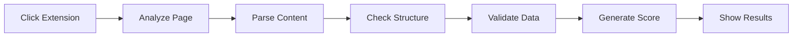

export const metadata = {
  title: 'Chrome Extension',
  description: 'Analyze any webpage\'s AEO readiness with the AEO.dev Chrome extension. Get instant optimization scores and recommendations.',
  openGraph: {
    title: 'Chrome Extension | AEO.dev',
    description: 'Analyze any webpage\'s AEO readiness with the AEO.dev Chrome extension. Get instant optimization scores and recommendations.',
    url: 'https://aeo.dev/tools/chrome-extension',
    siteName: 'AEO.dev',
    images: [{ url: '/images/website.png', width: 1200, height: 630, alt: 'AEO Chrome Extension' }],
    locale: 'en_US',
    type: 'article',
  },
}

# AEO Chrome Extension

Analyze any webpage's Answer Engine Optimization readiness with our free Chrome extension. Get instant scores, detailed breakdowns, and actionable recommendations. {{ className: 'lead' }}

<Note>
  The Chrome extension is currently in development. Join the waitlist to be notified when it launches.
</Note>

## Features

### Instant AEO Score

Get a comprehensive AEO score (0-100) for any webpage with breakdowns for:

- **Content Structure** — Heading hierarchy, semantic HTML
- **Structured Data** — Schema.org, JSON-LD implementation
- **Machine Readability** — llms.txt, robots.txt configuration
- **Authority Signals** — Author info, citations, expertise markers

### Detailed Analysis

View detailed reports including:

<Row>
  <Col>
    #### Content Analysis
    - Heading structure visualization
    - Content hierarchy mapping
    - Question/answer detection
    - Readability assessment
  </Col>
  <Col>
    #### Technical Checks
    - Structured data validation
    - Meta tag completeness
    - AI crawler accessibility
    - Performance metrics
  </Col>
</Row>

### Recommendations

Get specific, actionable recommendations:

```
⚠️ Missing FAQPage schema
   Add FAQ structured data to improve AI understanding
   of your question-answer content.
   
✓ Good heading hierarchy
   Your H1 → H2 → H3 structure is well organized.
   
⚠️ No llms.txt found
   Consider adding an llms.txt file to guide AI systems.
```

## How It Works



1. **Click the extension** on any webpage
2. **Automatic analysis** of page content and structure
3. **Score calculation** across multiple factors
4. **Detailed report** with recommendations
5. **Export options** for sharing and tracking

## Scoring Breakdown

| Category | Weight | What's Measured |
|----------|--------|-----------------|
| Content Structure | 30% | Headings, semantic HTML, organization |
| Structured Data | 25% | Schema.org, JSON-LD completeness |
| Machine Readability | 25% | llms.txt, robots.txt, accessibility |
| Authority Signals | 20% | Author info, E-E-A-T markers |

## Privacy

The extension:
- **Analyzes locally** — Page content is processed in your browser
- **No data collection** — We don't store your browsing data
- **No tracking** — No analytics on pages you visit
- **Open source** — Code is available for review

## Coming Soon

Features in development:

- **Competitive analysis** — Compare your site to competitors
- **Historical tracking** — Monitor AEO score over time
- **Bulk analysis** — Analyze multiple pages at once
- **Export reports** — PDF and JSON export options
- **Integration** — Connect with Google Search Console

## Get Notified

<div className="not-prose mt-6">
  <Button href="https://github.com/AEOdev" arrow="right">
    Follow on GitHub for Updates
  </Button>
</div>

## Alternative: Manual Analysis

While waiting for the extension, you can manually check AEO factors:

### 1. Check Structured Data
Use [Google's Rich Results Test](https://search.google.com/test/rich-results)

### 2. Validate llms.txt
Check if `yoursite.com/llms.txt` exists and is properly formatted

### 3. Review robots.txt
Verify AI crawlers are allowed in `yoursite.com/robots.txt`

### 4. Analyze Content Structure
Use browser DevTools to inspect heading hierarchy

## Next Steps

<div className="not-prose mt-6 flex gap-3">
  <Button href="/tools/mcp-server" arrow="right">
    MCP Server
  </Button>
  <Button href="/quickstart" variant="outline">
    Quickstart Guide
  </Button>
</div>

